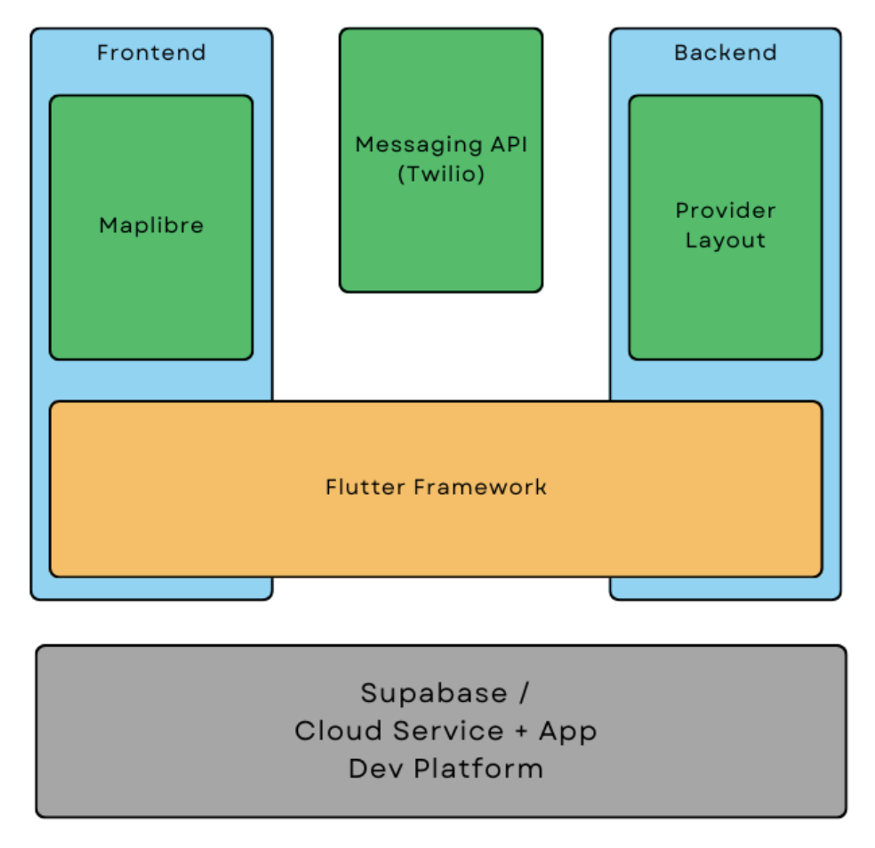
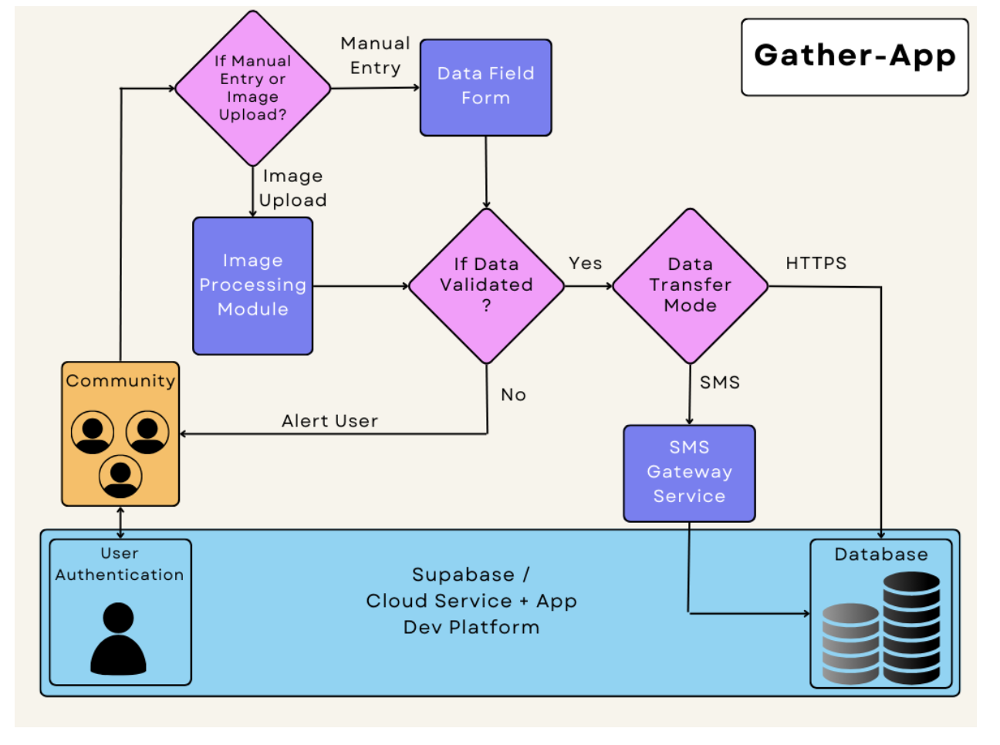

# GATHER APP

| GATHER Links & Badges              |                                                                             |
|------------------------|----------------------------------------------------------------------------------------------------------------------------------------------------------------------------------------------------------|
| GATHER Documentation      |       |
| License                |                                                               |
<!-- | Current Release DOI    |  | -->

----------

## Table of Contents

- [GATHER APP](#gather-app)
  - [Table of Contents](#table-of-contents)
  - [About](#about)
  - [Overview](#overview)
  - [Key Features](#key-features)
  - [Tech Stack](#tech-stack)
    - [Components](#components)
  - [Open Source](#open-source)
  - [License](#license)
  - [Help and Support](#help-and-support)

## About

This repository serves as the public source code repository of Gather, a community weather data collection application that is a component of the larger [CoS-IT-FloWS](https://cos-it-flows-documentation.readthedocs.io/en/latest/) system.

Gather as part of the [Community Sourced Impact Based Flood Forecast and Early Warning System](https://cos-it-flows-documentation.readthedocs.io/en/latest/), termed CoS-IT-FloWS that is being developed at EQUINOCT Community Sourced Modelling Solutions, hereafter referred to as EQUINOCT, under the UNICEF Office of Innovation's Venture Capital Fund that supports and guides their inaugural climate cohort of 8 startups from around the world to build Open Source technological solutions for sustainable climate action. All development activity for this application is coordinated through the [Gather github page](https://github.com/COS-IT-FLOWS/Gather), where you can also find all archived, current, beta, and development versions of the application.

## Overview

EQUINOCT is an early stage tech start-up formed in July 2020, that aims at building community data portals in data scarce regions that can facilitate real-time visualization, analysis,monitoring, and impact-based early warnings of climate change impacts using data sourced from communities through building local community partnerships.

Gather is a community weather data collection application. This app is developed for community members to conveniently enter and record the weather data (such as rainfall and groundwater levels) of their locality. This then serves as hyper local input data used in       CoS-IT-FLoWS, for enhanced reliability and accuracy in the flood forecast and early warning system.Gather is a user-centered application with features developed to increase the ease of data recording.

## Key Features

- **User Registration and Authentication** : New Users can Sign Up through Mail or Google Account and enter their details. Once their account is registered, Login is facilitated through User's Phone Number and authenticated.

- **Data Entry** : The user is prompted to record data in any of these categories:

    1. Rainfall
    2. River
    3. Well Water
    4. Tidal

  The data can either be entered manually or through capturing/uploading an image.

- **Image Processing** : To extract and record rainfall and water data from user captured/uploaded images.

- **Interactive Map Visualization** : High level weather insights from CoS-IT-FLoWS dashboard along with location tags at user's previous geographical points of data entry.

- **User Friendly UI** : Simple, intuitive and comprehensible UI designed centering beginner level users from local communities.

## Tech Stack

### Components

1. MapLibre - Mapping Library
2. Flutter - Mobile UI Framework
3. Supabase - App Development and Backend Services, used for Database and User Registration/Authentication
4. Twilio Messaging Service - Messaging API (Uses Abstraction Layer to be included as part of Open Source)
5. Flutterflow - Rapid Application Prototyping

## Open Source

We encourage any users who have modified (or would like to modify) Gather, either to fix bugs or develop new features, to contact us and coordinate development work with us. The Gather App source code is archived in Git and is publicly available through GitHub. To access the source code, visit GitHub, create an account, and visit [github.com/COS-IT-FLOWS/Gather](https://github.com/COS-IT-FLOWS/Gather).

Gather is an open source development application and is released under the terms of the [MIT License](./License.md).

Instructions for using Git and GitHub to access the Gather code and contribute changes are here:

[Working with GIT and GitHub](./UserGuide.md)

By placing the original source code archive on GitHub, we hope to encourage a more collaborative development environment. A guide on [how to contribute](./Contribute.md) your changes to the application can be found on the git page. The most stable version of the system is in the main branch, while beta versions of releases under development can be obtained from the development branches of this repository.

## License

Gather is released under the [MIT License](./License.md).See the `License` file for more information.

The Gather documentation content is licensed under a [Creative Commons Attribution-ShareAlike 4.0 International License](https://creativecommons.org/licenses/by-sa/4.0/).

## Help and Support

If you have any questions, feedback, or suggestions, please feel free to reach out to us at <team@equinoct.com>. You can raise an issue in the issue tracker.
